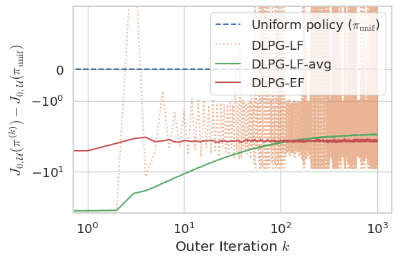
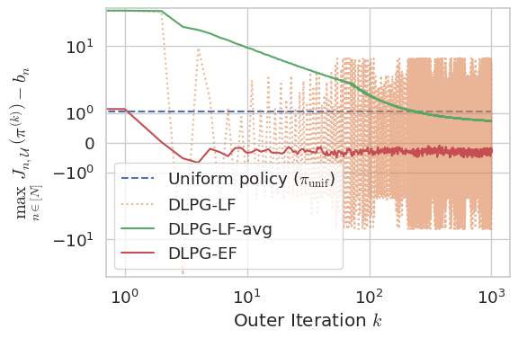

# Official Implementations of "Near-Optimal Policy Identification in Robust Constrained Markov Decision Processes via Epigraph Form" [Experiments in Section 7]

This repository is the official implementation of the DLPG-EF algorithm in [Near-Optimal Policy Identification in Robust Constrained Markov Decision Processes via Epigraph Form](TODO).

* You can see the implementation in [experiments.ipynb](experiments.ipynb).





## Requirements

```bash
# make sure you are in Uniform-PAC-Primal-Dual-CMDP/
poetry install
```

## Run Experiments and Plot the results

Run all the cells in [experiments.ipynb](experiments.ipynb).