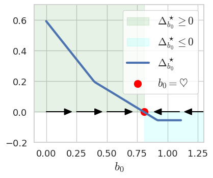
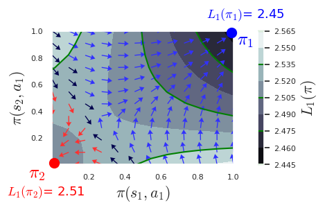

# Official Implementations of "Near-Optimal Policy Identification in Robust Constrained Markov Decision Processes via Epigraph Form"

This repository is the official implementation to reproduce the figures in [Near-Optimal Policy Identification in Robust Constrained Markov Decision Processes via Epigraph Form](https://arxiv.org/abs/2408.16286).

Please see [experiments.ipynb](experiments.ipynb), [algorithm-concept.ipynb](algorithm-concept.ipynb), and [grad-conflict.ipynb](grad-conflict.ipynb).






## Requirements

```bash
# make sure you are in RCMDP-Epigraph/
poetry install
```

## Run Experiments and Plot the results

Run all the cells in 
* [benchmarks/finite-set.ipynb](benchmarks/finite-set.ipynb) 
* [algorithm-concept.ipynb](algorithm-concept.ipynb).
* [grad-conflict.ipynb](grad-conflict.ipynb).
